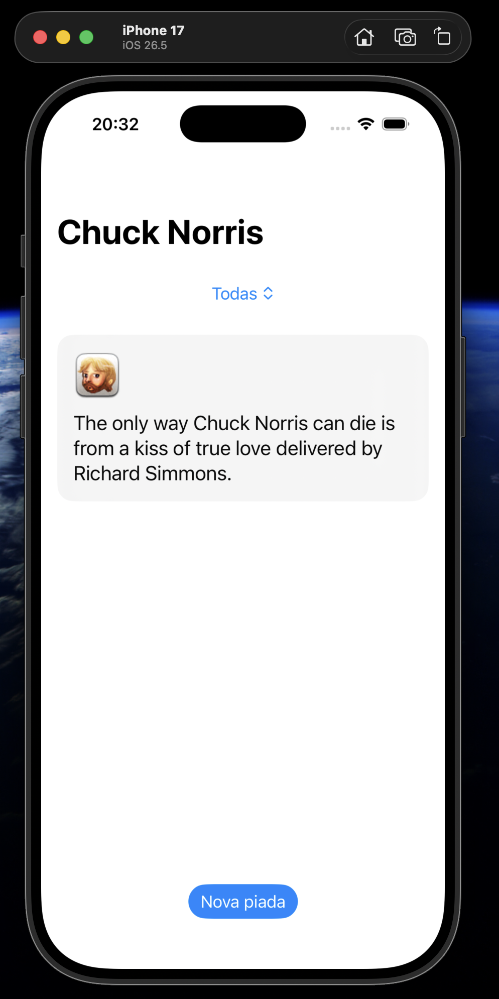

# Chuck Norris Jokes 🥋

An iOS app that fetches random Chuck Norris jokes from the public [chucknorris.io](https://api.chucknorris.io) API, built with **SwiftUI**, **Swift Concurrency** and **Clean Architecture (MVVM)**, with no third-party dependencies.

<p align="center">
  
</p>

## Features

- Random joke on launch
- Filter jokes by category
- "New joke" button with cancellation of in-flight requests
- Loading and error states (for example, no internet connection)
- SwiftUI previews with a fake repository (success and error states)

## Tech Stack

| Topic | Choice |
|---|---|
| UI | SwiftUI |
| Architecture | Clean Architecture + MVVM |
| Networking | `URLSession` + `async/await` |
| JSON parsing | `Codable` (`JSONDecoder` with `.convertFromSnakeCase`) |
| State | `@Observable` + `@MainActor` |
| Dependency injection | Manual DI (Composition Root + per-feature containers) |
| Dependencies | None (100% native) |

## Architecture

```
┌──────────────────── Presentation ────────────────────┐
│  JokeView (SwiftUI)  ──►  JokeViewModel (@Observable) │
└──────────────────────────┬───────────────────────────┘
                           ▼
┌─────────────────────── Domain ───────────────────────┐
│  GetRandomJokeUseCase / GetCategoriesUseCase          │
│  JokeRepositoryProtocol · Joke · AppError             │
└──────────────────────────┬───────────────────────────┘
                           ▼
┌──────────────────────── Data ────────────────────────┐
│  JokeRepositoryImpl ──► JokeRemoteDataSource          │
│  JokeDTO ──(JokeMapper)──► Joke                       │
│  NetworkError ──(mapError)──► AppError                │
└──────────────────────────┬───────────────────────────┘
                           ▼
┌──────────────────────── Core ────────────────────────┐
│  APIClient (URLSession) · Endpoint · HTTPMethod       │
└──────────────────────────┬───────────────────────────┘
                           ▼
                   api.chucknorris.io
```

- **Domain** has no knowledge of networking or JSON. It only defines models, repository contracts and use cases.
- **Data** implements the repository, maps DTOs to domain models and translates `NetworkError` into `AppError`.
- **Presentation** turns `AppError` into user-facing messages and exposes a single `State` enum to the view.
- **DI**: `AppContainer` holds shared dependencies (`APIClient`) and creates each feature container (`JokeDIContainer`).

## Project Structure

```
ChuckNorrisJokes/
├── App/
│   ├── ChuckNorrisJokesApp.swift       # @main entry point
│   └── AppContainer.swift              # Composition Root
├── Core/
│   ├── Error/AppError.swift
│   └── Network/
│       ├── APIClient.swift             # Generic URLSession client
│       ├── Endpoint.swift
│       ├── HTTPMethod.swift
│       └── NetworkError.swift
└── Features/Joke/
    ├── DI/JokeDIContainer.swift
    ├── Data/
    │   ├── API/JokeEndpoint.swift
    │   ├── DataSource/
    │   ├── Mapper/JokeMapper.swift
    │   ├── Model/JokeDTO.swift
    │   └── Repository/JokeRepositoryImpl.swift
    ├── Domain/
    │   ├── Model/Joke.swift
    │   ├── Repository/JokeRepositoryProtocol.swift
    │   └── UseCase/
    └── Presentation/
        ├── Extensions/AppError+Message.swift
        ├── Preview/
        ├── ViewModel/JokeViewModel.swift
        └── Views/
            ├── JokeView.swift
            └── Components/JokeCard.swift
```

## API

| Endpoint | Description |
|---|---|
| `GET /jokes/random` | Random joke |
| `GET /jokes/random?category={category}` | Random joke from a category |
| `GET /jokes/categories` | List of categories |

No API key required.

## Requirements

- Xcode 26+
- iOS 26.5+

## Getting Started

```bash
git clone https://github.com/<your-username>/ChuckNorrisJokes.git
cd ChuckNorrisJokes
xed .
```

Then select an iPhone simulator and press **⌘R**.

## Roadmap

- [ ] Unit tests with Swift Testing (ViewModel, use cases, repository)
- [ ] Base URL in `.xcconfig` (Debug / Release)
- [ ] Endpoints as an enum with cases
- [ ] Move `Core/Network` into a local Swift Package

## Author

**Junior**, Android developer learning iOS 🚀
